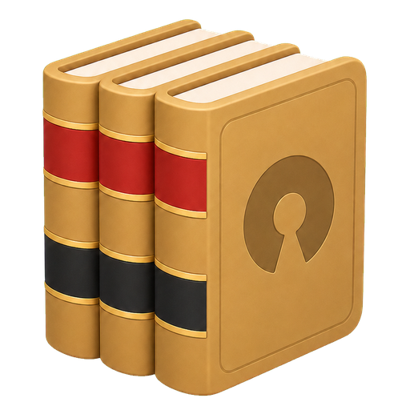

# Open Law Lens



Open Law Lens is a practical legal research app for working with public legal
authority through open tools. It is built around CourtListener, local caching,
an inspectable SQLite library, a GTK/Libadwaita reader, and terminal-friendly
CLI commands that can be used directly by people or by Codex.

The goal is to make legal authority easier to inspect, reuse, and
research without depending on large commercial platforms. Court
opinions, statutes, and court rules are public legal materials. Open Law Lens is
intended to help lawyers, researchers, and technically curious users work with
those materials in a transparent local workflow.

## CourtListener and Free Law Project

Open Law Lens relies on [CourtListener](https://www.courtlistener.com/) for case
law search, citation lookup, opinion metadata, opinion text, and citation graph
data. CourtListener is a project of [Free Law Project](https://free.law/about/),
a 501(c)(3) nonprofit that uses technology, data, and advocacy to make the legal
ecosystem more open, and equitable.

CourtListener provides legal APIs for developers and researchers. Some API
endpoints can be explored without authentication, but Open Law Lens users should
create a CourtListener account and use an API token for regular use. The token
improves reliability, makes throttling more predictable, and is required for
some workflows.

Get your token from your CourtListener profile:

https://www.courtlistener.com/profile/api-token/

Then either export it before running Open Law Lens:

```bash
export COURTLISTENER_TOKEN="your-token"
```

Or save it in the app menu under Settings. The Settings path writes a local
`config.json` file in the project root.

## Features

- GTK4/Libadwaita desktop app with a quiet reader-focused interface.
- Citation lookup for cases through CourtListener.
- California statute and California Rules of Court lookup.
- Research Cache sidebar for the authorities currently in view.
- Durable SQLite library at `library/open_law_lens.sqlite3` for saved authority
  data, display text, and reporter page-marker metadata.
- Disposable JSON API cache under `cache/`.
- Cited By lookup using CourtListener citation graph data, with published cases
  shown first by default.
- Google Scholar fallback and manual import flow when CourtListener lacks an
  official reporter copy.
- Reader links for cited cases, statutes, and rules.
- Named Research Cache sets.
- Selected-text launcher through `open-law-lens open-selected`.
- Optional embedded Codex workflow for legal research questions.

## Requirements

- Python 3.13+
- `uv`
- GTK 4, Libadwaita, and PyGObject system packages
- Optional: GTK VTE packages for the embedded Codex terminal
- Optional: Codex CLI for agent queries

Ubuntu/Debian package names vary by release, but the GTK stack is typically
provided by packages such as:

```bash
sudo apt install python3-gi gir1.2-gtk-4.0 gir1.2-adw-1
```

Install or sync the Python environment with:

```bash
uv sync
```

## Run the App

Launch the GTK app:

```bash
uv run open-law-lens app
```

Open an authority directly:

```bash
uv run open-law-lens open "In re Caden C. (2021) 11 Cal.5th 614"
```

Open the first authority found in the current OS selection or clipboard:

```bash
uv run open-law-lens open-selected
```

## CLI Commands

Open Law Lens exposes its research tools through the `open-law-lens` command.
The CLI is meant to be useful both to humans in a terminal and to coding agents
that need predictable JSON/text outputs.

Show the full command surface:

```bash
uv run open-law-lens --help
```

Show the agent-oriented command list with examples:

```bash
uv run open-law-lens --list-cli-commands
```

Common examples:

```bash
uv run open-law-lens lookup-citation "576 U.S. 644"
uv run open-law-lens lookup-citation "576 U.S. 644" --text
uv run open-law-lens extract-case "13 Cal.4th 952"
uv run open-law-lens case-search "beneficial relationship exception"
uv run open-law-lens extract-statute "Welf. & Inst. Code, § 300"
uv run open-law-lens extract-rule "Cal. Rules of Court, rule 8.1115"
uv run open-law-lens best-published-citing-case --cluster-id 6240402 --json
```

Maintenance and inspection commands:

```bash
uv run open-law-lens show-library
uv run open-law-lens show-cache
uv run open-law-lens show-research-sets
uv run open-law-lens save-research-set "Case Name_research"
uv run open-law-lens load-research-set "Case Name_research"
uv run open-law-lens cache-dir
uv run open-law-lens library-db
uv run open-law-lens clear-cache
uv run open-law-lens prune-library
```

## Agent Queries

General legal research questions require the Codex CLI app. Open Law Lens
launches Codex in an embedded terminal, gives it a focused legal-research
prompt, and directs it to use Open Law Lens CLI commands for
CourtListener-backed research. Codex can be configured to use different model
providers, including open models served through third-party inference providers
such as Fireworks AI, so the agentic workflow is not limited to a single model
vendor.

This agent workflow does not rely on the CourtListener MCP server. That is an
intentional design choice. The CLI path keeps the app more responsive, easier to
install, and less dependent on extra runtime services while still tying legal
authority lookup to CourtListener APIs and the app's local cache/library model.

There are two main agent modes:

- Law: ask a California legal research question. The default prompt directs
  Codex to search and extract authority through Open Law Lens CLI commands.
- Cache: ask about authorities marked in the current Research Cache. The app
  exports the selected authorities into a temporary workspace and asks Codex to
  answer only from those materials.

Agent runtime settings, including the prompt templates and Codex permission
mode, are available in the app Settings window.

## Library and Cache

Open Law Lens keeps a durable SQLite authority library at
`library/open_law_lens.sqlite3` by default. The library stores raw
CourtListener JSON plus display-ready opinion text. When CourtListener provides
explicit reporter page markers, the app preserves them inline as markers such
as `[*373]` and renders those markers prominently in the reader.

The `cache/` directory is a disposable JSON API cache. Lookups check the library
first, then the JSON cache, then CourtListener. Cache or API hits are saved into
the library for faster future access.

The app sidebar is the Research Cache, not the full library. Clearing the
Research Cache removes those visible sidebar authorities while preserving the
durable library so future lookups can still be served without another API call.

For isolated test or smoke-run data, use:

```bash
OPEN_LAW_LENS_CACHE_DIR=/tmp/open-law-lens-cache \
OPEN_LAW_LENS_LIBRARY_DB=/tmp/open-law-lens-library.sqlite3 \
uv run open-law-lens show-cache
```

## Google Scholar Fallback

When CourtListener cannot return an official reporter citation, the app opens a
Find Case Online window. Auto-Find on Scholar tries a direct Google Scholar
case-law search, follows the first case result, and feeds the discovered URL
into the existing Fetch flow automatically.

After a citation lookup, the app also tries this Scholar flow automatically when
CourtListener has no matching case or returns only a transient copy without
official reporter pagination. If the Scholar text passes the same official
pagination check, it is saved to the Library and Research Cache automatically.
Manual Scholar imports still open for review before saving.

If Scholar blocks the direct request, returns a CAPTCHA, or has no readable case
result, the app opens the Scholar search in your browser so you can paste a case
URL manually.

## Project Layout

- `open_law_lens/app.py`: GTK/Libadwaita app, reader, Research Cache, settings,
  and embedded Codex workflow.
- `open_law_lens/cli.py`: `open-law-lens` command dispatcher.
- `open_law_lens/client.py`: CourtListener API access and opinion extraction.
- `open_law_lens/cache.py`: disposable JSON cache layout and citation
  normalization.
- `open_law_lens/library.py`: durable SQLite library, display text, page
  markers, and Research Cache sets.
- `open_law_lens/config.py`: local settings, including the CourtListener token.
- `scripts/open-law-lens-codex-agent-vte.sh`: embedded Codex terminal launcher.

## Local Files and Credentials

Do not commit local runtime data:

- `config.json`: local settings and CourtListener token.
- `cache/`: disposable CourtListener lookup and import cache.
- `library/`: durable local SQLite authority library.
- `.venv/`, `__pycache__/`, `.pytest_cache/`, and `.mypy_cache/`: generated
  development artifacts.

These paths are ignored by Git in this repository.

## Tests

Run the unit tests:

```bash
uv run python -m unittest discover -s tests
```

Run a quick syntax check:

```bash
uv run python -m py_compile open_law_lens/*.py
```

Check Markdown and whitespace-sensitive diffs before committing:

```bash
git diff --check
```
